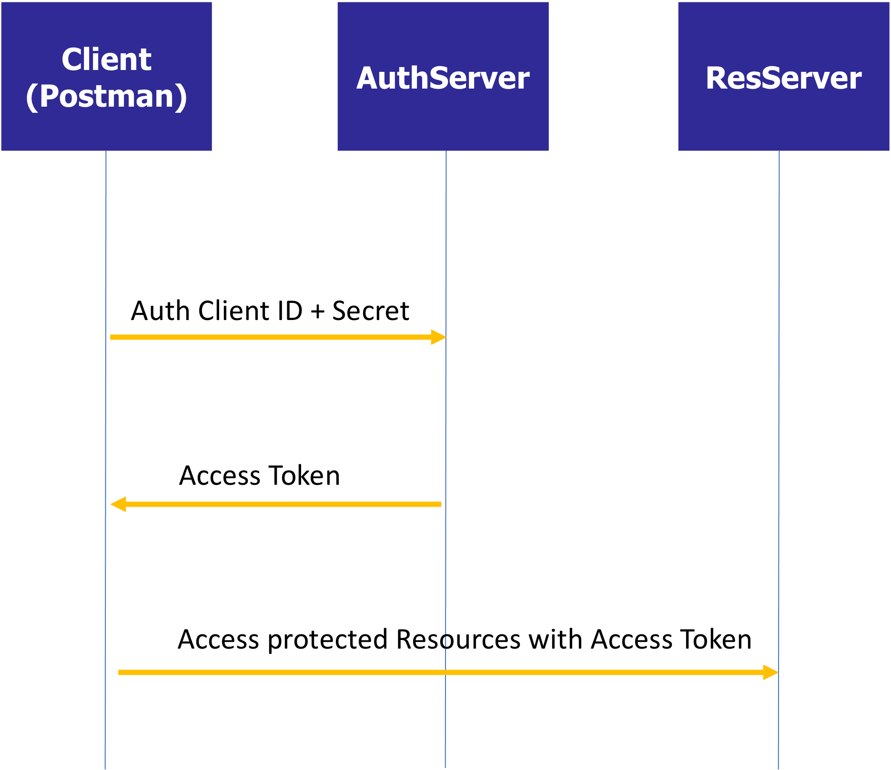
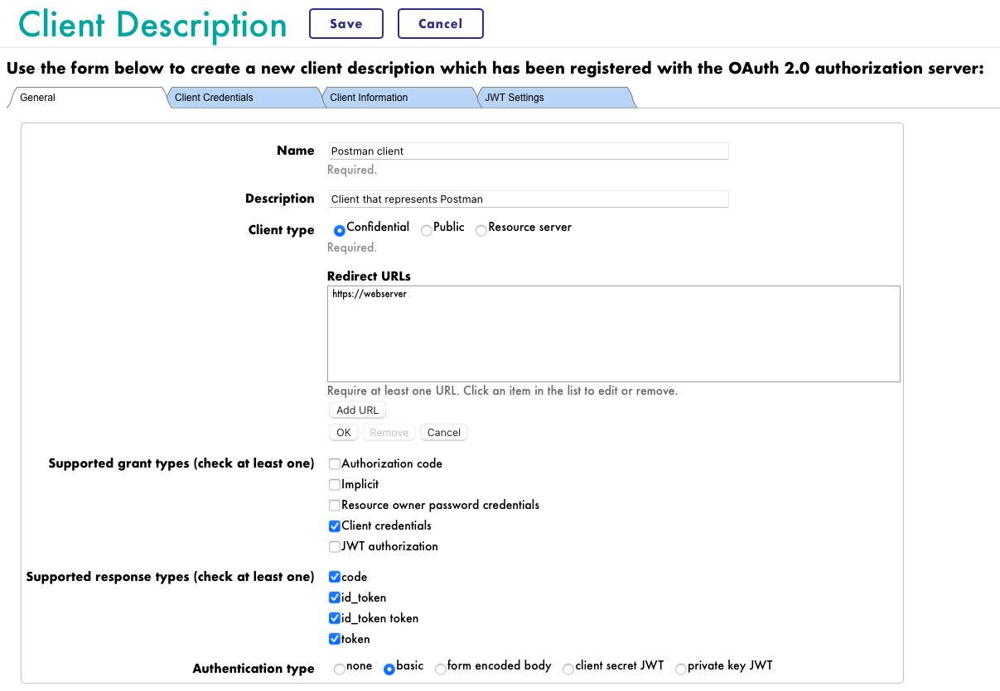
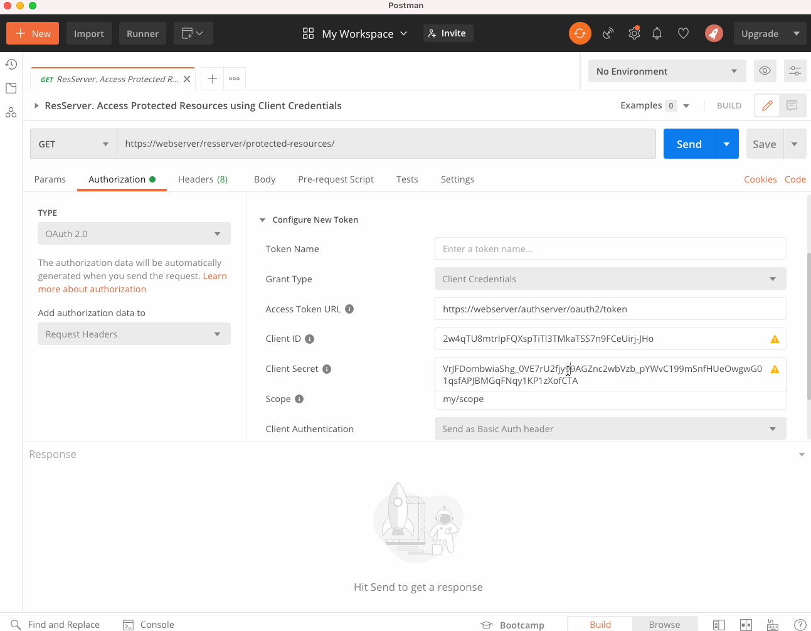

Using OAuth2 framework in InterSystems IRIS. Learn how to act as Client, Authentication Server or Resource Server.

Quick setup of all three servers,
Troubleshooting

# Setup
## Modify your local hosts file 
Add new configuration line to your hosts file to resolve webserver to 127.0.0.1:
```
127.0.0.1 webserver
```

You can find your hosts file in:
| O.S. | File |
| --------- | ----------- |
| MacOS | `/private/etc/hosts` |
| Windows | `c:\Windows\System32\Drivers\etc\hosts` |

# Hands on - let's prepare servers on docker

Install required tools:

git

Windows:
https://gitforwindows.org/

Mac:
https://sourceforge.net/projects/git-osx-installer/files/git-2.23.0-intel-universal-mavericks.dmg/download?use_mirror=autoselect

```
Brew install git
```

Docker for desktop

Windows and Mac:
https://www.docker.com/products/docker-desktop/

Mac:
```
Brew install docker
```


Preload all needed images:

Login to Intersystems docker repository
https://containers.intersystems.com

Obtain your docker login command from the  portal

Login using above command and pull required images:

```
docker login -u="wczyz" -p="738v6fsXXXXXXXXvZwpgcwCdNaxNtKQ4hBYb"  containers.intersystems.com

docker pull containers.intersystems.com/intersystems/iris-community:2022.1.2.574.0

docker pull containers.intersystems.com/intersystems/webgateway:2022.1.2.574.0
```

Let's create and start servers
Build images:
```
docker-compose build
```

Run containers:
```
docker-compose up -d
```

# Hands on - Registering OAuth2 servers on docker 

Prepare authorization server - already done!

```
docker exec -it authserver iris terminal IRIS
```

Node: authserver, Instance: IRIS
USER>zn "AUTHSERVER"
AUTHSERVER>do ##class(auth.server.Utils).CreateServerConfig()
1

Prepare client server

```
docker exec -it client iris terminal IRIS
```
Node: client, Instance: IRIS
```
zn "client"
write ##class(client.Installer).SetupOauth2Client()
```

Prepare resource server

```
docker exec -it resourceserver iris terminal IRIS
```
Node: resserver, Instance: IRIS
```
zn "resserver"
write ##class(res.Installer).SetupOauth2Client()
```

# Hands on - Oauth2 authorization test


https://webserver/client/application/

Superuser	SYS
developer	test

# Overview

After running containers, you should get access to:
| Container  | Mng. Portal URL                                    | Notes                                                |
| ---------  | -----------                                        | -----------                                          |
| webserver  | https://webserver/csp/bin/Systems/Module.cxw       | HTTPS access to all IRIS instances                   |
| authserver | https://webserver/authserver/csp/sys/UtilHome.csp  | IRIS instance that will act as Authorization Server  |
| resserver  | https://webserver/resserver/csp/sys/UtilHome.csp   | IRIS instance that will act as Resource Server       |
| client     | https://webserver/client/csp/sys/UtilHome.csp      | IRIS instance that will act as Client                |

You can login in InterSystems IRIS instances using `superuser`/`SYS`.


# Hands on troubleshooting

kill ^ISCLOG // clear the global
set ^%ISCLOG("Category","OAuth2Server")=1
set ^%ISCLOG("Category","OAuth2")=1
set ^%ISCLOG=3

Perform test

set ^%ISCLOG=0 //disable logging
do $system.OBJ.Export("ISCLOG.GBL","c:\temp\isclog.xml")
do ##class(%OAuth2.Utils).DisplayLog("/tmp/isclog.log")


docker exec -it resserver iris terminal IRIS

set ^%ISCLOG("Category","OAuth2Server")=1
set ^%ISCLOG("Category","OAuth2")=1
set ^%ISCLOG=3

## (a.4) Test

### Client Application
* In the [Client](https://webserver/client/csp/sys/UtilHome.csp) instance you have already a simple web app created that uses the `%OAuth2` classes.
* Have a look at the code of [client.Application](oauth-client/src/client/Application.cls)
* Test the application using https://webserver/client/application/
  * Try accessing with `superuser`/`SYS` or `developer`/`test`. 
  * Notice that these users are actually defined in [AuthServer](https://webserver/authserver/csp/sys/UtilHome.csp) instance.

### Resource Server
* In the [ResServer](https://webserver/resserver/csp/sys/UtilHome.csp) instance, you also have the resource server prepared.
* Check [res.Server](oauth-resource-server/src/res/Server.cls) source code.
* Resource server can be accessed only through the client application (otherwise it will return an error). 
* The protected resource URL is: https://webserver/resserver/protected-resources/

You should get something like that:


# (b) Client Credentials Example



Now, we are going to access the protected resources through Postman using the client credentials grant type.

## (b.1) AuthServer

### Enable Client Credentials
* In [AuthServer](https://webserver/authserver/csp/sys/UtilHome.csp), go to *System Administration > Security > OAuth 2.0 > Server*
* Enable `Client credentials` as a supported grant type.
* After that auth server will be able to use both authorization code and client credentials grant types.

### Create a client definition
* Again in [AuthServer](https://webserver/authserver/csp/sys/UtilHome.csp), go to *System Administration > Security > OAuth 2.0 > Server > Client Descriptions*
* Create a client description for our Postman client



* In the **Client Credentials** tab, copy `Client ID` and `Client Secret` values. You will these values in Postman.

## (b.2) Test 

### Postman client
* Import [IRISOAuth2.postman_collection.json](./IRISOAuth2.postman_collection.json) in Postman.
* In the *Authorization* tab of the request, copy the values of `Client ID` and `Client Secret`.
* After that, get a new token and then access the protected resources:


