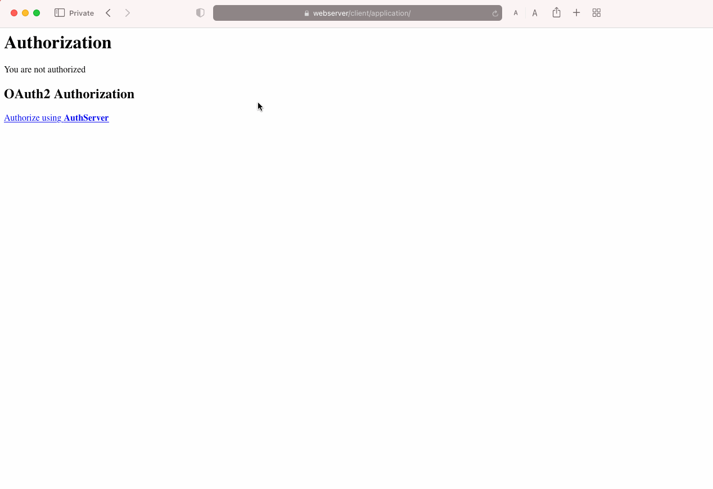

Using OAuth2 framework in InterSystems IRIS. Learn how to act as Client, Authentication Server or Resource Server.

Quick setup of all three servers,
Troubleshooting

# 6. Hands on - let's prepare servers on docker

Install required tools:

Git

Windows:
https://gitforwindows.org/

Mac:
https://sourceforge.net/projects/git-osx-installer/files/git-2.23.0-intel-universal-mavericks.dmg/download?use_mirror=autoselect

```
Brew install git
```

Docker for desktop

Windows and Mac:
https://www.docker.com/products/docker-desktop/

Mac:
```
Brew install docker
```


Preload all needed images:

Login to Intersystems docker repository
https://containers.intersystems.com

Obtain your docker login command from the  portal

Login using above command and pull required images:

```
docker login -u="wczyz" -p="INSERT-YOUR-TOKEN-HERE"  containers.intersystems.com

docker pull containers.intersystems.com/intersystems/iris-community:2022.1.2.574.0

docker pull containers.intersystems.com/intersystems/webgateway:2022.2.0.372.0
```

All tools are loaded now, lets start setting up

# 7. Hands on - Setting setting up OAuth2 servers

Modify your local hosts file 

Add new configuration line to your hosts file to resolve webserver to 127.0.0.1:
```
127.0.0.1 webserver
```


You can find your hosts file in:
| O.S. | File |
| --------- | ----------- |
| MacOS | `/private/etc/hosts` |
| Windows | `c:\Windows\System32\Drivers\etc\hosts` |


Load code (and this readme file) on your machine:
```
git clone https://github.com/wojciechczyz/OAuth2Handson.git
cd .\OAuth2Handson\
```

Let's create and start servers
Build images:
```
docker-compose build
```

Run containers:
```
docker-compose up -d
```

# 8. Hands on - Registering OAuth2 Client and Resource server

Prepare authorization server - already done!

```
docker exec -it authserver iris terminal IRIS
```

Node: authserver, Instance: IRIS
USER>zn "AUTHSERVER"
AUTHSERVER>do ##class(auth.server.Utils).CreateServerConfig()
1

Prepare client server

```
docker exec -it client iris terminal IRIS
```
Node: client, Instance: IRIS
```
zn "client"
write ##class(client.Installer).SetupOauth2Client()
```

Prepare resource server

```
docker exec -it resourceserver iris terminal IRIS
```
Node: resserver, Instance: IRIS
```
zn "resserver"
write ##class(res.Installer).SetupOauth2Client()
```

# 9.Hands on - Review configuration

After running containers, you should get access to:
| Container  | Mng. Portal URL                                    | Notes                                                |
| ---------  | -----------                                        | -----------                                          |
| webserver  | https://webserver/csp/bin/Systems/Module.cxw       | HTTPS access to all IRIS instances                   |
| authserver | https://webserver/authserver/csp/sys/UtilHome.csp  | IRIS instance that will act as Authorization Server  |
| resserver  | https://webserver/resserver/csp/sys/UtilHome.csp   | IRIS instance that will act as Resource Server       |
| client     | https://webserver/client/csp/sys/UtilHome.csp      | IRIS instance that will act as Client                |

You can login in InterSystems IRIS instances using `superuser`/`SYS`.

Resource server
* [ResServer](https://webserver/resserver/csp/sys/UtilHome.csp) is serving protected resource URL:

```
* https://webserver/resserver/protected-resources/
```

* Resource server can be accessed only through the client application (otherwise it will return an error). 

[AuthServer](https://webserver/authserver/csp/sys/UtilHome.csp) has 


# 10.Hands on - Test OAuth2 workflow with Web Client Application

In the [Client](https://webserver/client/csp/sys/UtilHome.csp) instance you have already a simple web app created that
will attempt to connect to the resource server attempting to get authorization with  `%OAuth2` classes.

https://webserver/client/application/

Superuser	SYS
developer	test

Notice that these users are actually defined in [AuthServer](https://webserver/authserver/csp/sys/UtilHome.csp) instance.

11.Hands on - Test OAuth2 workflow with Web Client Application - result

# 12.Hands on troubleshooting

kill ^ISCLOG // clear the global
set ^%ISCLOG("Category","OAuth2Server")=1
set ^%ISCLOG("Category","OAuth2")=1
set ^%ISCLOG=3

***Perform test***

set ^%ISCLOG=0 //disable logging
do $system.OBJ.Export("ISCLOG.GBL","c:\temp\isclog.xml")
do ##class(%OAuth2.Utils).DisplayLog("/tmp/isclog.log")


## Hands on - OAuth2 configuration
 
 
 
 Have a look at the code of [client.Application](oauth-client/src/client/Application.cls)


### Resource Server
* In the [ResServer](https://webserver/resserver/csp/sys/UtilHome.csp) instance, you also have the resource server prepared.
* Check [res.Server](oauth-resource-server/src/res/Server.cls) source code.
* Resource server can be accessed only through the client application (otherwise it will return an error). 
* The protected resource URL is: https://webserver/resserver/protected-resources/

You should get something like that:


